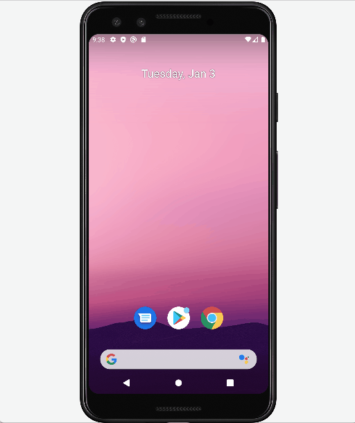

# Android Prework - *Hello World*

Submitted by: **Mufaddal Shakir**

**Hello World** is an android app that shows an image and introductory message, and allows pressing a button to display a Toast. 

Time spent: **1 hour** spent in total

## Required Features

The following **required** functionality is completed:

* [x] Image and introductory message displayed on screen
* [x] Button displayed on screen
* [x] Toast with message appears when button is pressed 

## Video Walkthrough

Here's a walkthrough of implemented features:

GIF created with [ScreenToGif](https://www.screentogif.com/) for Windows

## Notes

No major challenges experienced during the development of this app.

## License

    Copyright [2022] [Mufaddal Shakir]

    Licensed under the Apache License, Version 2.0 (the "License");
    you may not use this file except in compliance with the License.
    You may obtain a copy of the License at

        http://www.apache.org/licenses/LICENSE-2.0

    Unless required by applicable law or agreed to in writing, software
    distributed under the License is distributed on an "AS IS" BASIS,
    WITHOUT WARRANTIES OR CONDITIONS OF ANY KIND, either express or implied.
    See the License for the specific language governing permissions and
    limitations under the License.
